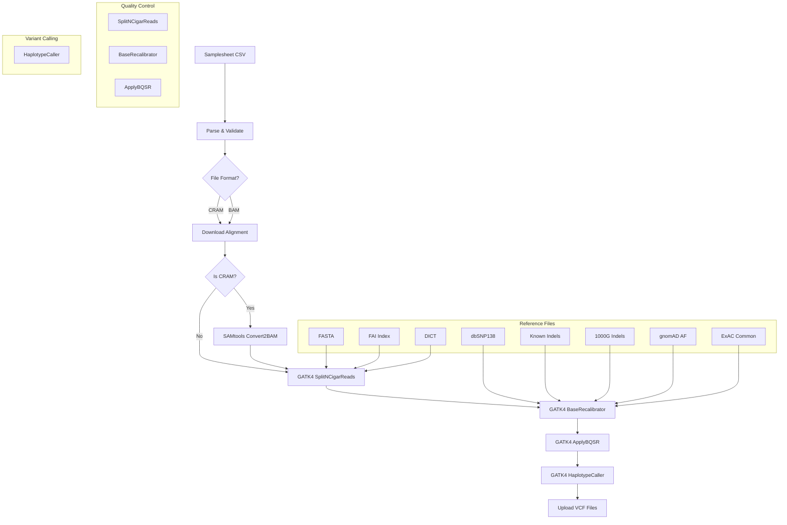

# nl-rna-varcall

A Nextflow pipeline for variant calling from RNA-seq aligned data using GATK4. This pipeline processes BAM/CRAM files and performs comprehensive variant calling with quality control steps.

## Overview

This pipeline implements a complete RNA-seq variant calling workflow that includes:

- **File Format Support**: Handles both BAM and CRAM alignment files
- **Quality Control**: SplitNCigarReads for RNA-seq specific processing
- **Base Quality Recalibration**: Uses multiple known variant databases
- **Variant Calling**: HaplotypeCaller for sensitive variant detection
- **Cloud Integration**: Download from and upload to S3 storage

## Architecture



## Pipeline Steps

1. **Input Validation**: Validates alignment file formats (BAM/CRAM)
2. **File Download**: Downloads alignment files from S3 if needed
3. **Format Conversion**: Converts CRAM to BAM if necessary
4. **SplitNCigarReads**: RNA-seq specific processing for split reads
5. **BaseRecalibrator**: Quality score recalibration using known variants
6. **ApplyBQSR**: Applies recalibration tables
7. **HaplotypeCaller**: Sensitive variant calling
8. **Upload Results**: Uploads VCF files to S3

## Prerequisites

### Alternative Download Method for reference files

You can also download these files using gsutil:
```bash
# Example for downloading from Google Cloud Storage
gsutil cp gs://bucket-name/reference-files/ .
```

## Input Files

### Samplesheet Format

Create a `samplesheet.csv` file with the following format:

```csv
sample,alignment,index,s3_path
CDMD1601,/path/to/CDMD1601.hg38_rna.22.cram,/path/to/CDMD1601.hg38_rna.22.cram.crai,s3://bucket/samples/CDMD1601
```

**Columns:**
- `sample`: Sample identifier
- `alignment`: Path to BAM/CRAM file (local or S3)
- `index`: Path to BAI/CRAI index file
- `s3_path`: S3 path for uploading results

> **Supported formats**: BAM (.bam) and CRAM (.cram) files

## Usage

### Basic Run

```bash
cd /path/to/nl-rna-varcall/
nextflow run main.nf --samplesheet samplesheet.csv
```

### With Custom Parameters

```bash
nextflow run main.nf \
    --samplesheet samplesheet.csv \
    --fasta /path/to/reference.fa \
    --fai /path/to/reference.fa.fai \
    --dict /path/to/reference.dict
```

## Outputs

The pipeline generates the following outputs in the `results/` directory:

```
results/
├── {sample}.hc.vcf.gz          # Compressed VCF file with variants
├── {sample}.hc.vcf.gz.tbi      # Tabix index for VCF
├── {sample}.hc.vcf.gz.md5      # MD5 checksum
└── versions.yml                 # Software versions used
```

### Output Files Description

- **VCF Files**: Variant call format files containing detected variants
- **Index Files**: Tabix indices for efficient VCF querying
- **Checksums**: MD5 hashes for file integrity verification
- **Versions**: Complete software version tracking

## Configuration

### Nextflow Configuration

Update `nextflow.config` with your reference file paths:

```groovy
params {
    fasta = '/path/to/GRCh38.primary_assembly.genome.fa'
    fai = '/path/to/GRCh38.primary_assembly.genome.fa.fai'
    dict = '/path/to/GRCh38.primary_assembly.genome.dict'
    dbsnp138 = '/path/to/Homo_sapiens_assembly38.dbsnp138.vcf.gz'
    // ... other reference files
}
```

## Quality Control

The pipeline includes several quality control steps:

1. **Input Validation**: Ensures alignment files are in supported formats
2. **SplitNCigarReads**: Handles RNA-seq specific split reads
3. **Base Quality Recalibration**: Improves base quality scores using known variants
4. **Multiple Reference Databases**: Uses comprehensive variant databases for recalibration

## Performance

- **Parallel Processing**: Nextflow enables parallel processing of multiple samples
- **Resource Management**: Configurable CPU and memory requirements
- **Resume Capability**: Can resume from failed steps
- **Cloud Integration**: Native S3 support for input/output

## Troubleshooting

### Common Issues

1. **Missing Reference Files**: Ensure all reference files are downloaded and paths are correct
2. **Memory Issues**: Increase memory allocation for large files
3. **S3 Access**: Verify AWS credentials and S3 permissions
4. **File Format Errors**: Check that alignment files are valid BAM/CRAM

### Logs and Debugging

```bash
# View detailed logs
nextflow log

# Resume from specific step
nextflow run main.nf -resume

# Check resource usage
nextflow run main.nf -with-trace
```

## Citation

If you use this pipeline in your research, please cite:

- Nextflow: [Di Tommaso et al. (2017)](https://www.nature.com/nbt/journal/v35/n4/full/nbt.3820.html)
- GATK4: [McKenna et al. (2010)](https://genome.cshlp.org/content/20/9/1297)
- SAMtools: [Li et al. (2009)](https://academic.oup.com/bioinformatics/article/25/16/2078/204688)

## License

This pipeline is licensed under the MIT License. See the [LICENSE](LICENSE) file for details.