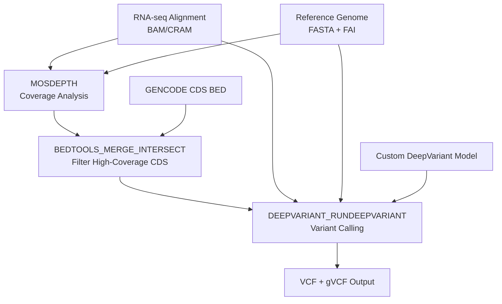

# nl-rna-varcall

A Nextflow pipeline for variant calling from RNA-seq aligned data using DeepVariant with customized models for transcriptomic data.

## Overview

This pipeline processes RNA-seq alignment files (BAM/CRAM) to identify genetic variants using a three-step approach:

1. **Coverage Analysis** (Mosdepth): Calculate per-base coverage depth
2. **Region Filtering** (BedTools): Intersect high-coverage regions with coding sequences
3. **Variant Calling** (DeepVariant): Call variants using a custom RNA-seq model

## Workflow


```mermaid
flowchart TD
    A[RNA-seq Alignment<br/>BAM/CRAM] --> B[MOSDEPTH<br/>Coverage Analysis]
    C[Reference Genome<br/>FASTA + FAI] --> B
    B --> D[BEDTOOLS_MERGE_INTERSECT<br/>Filter High-Coverage CDS]
    E[GENCODE CDS BED] --> D
    D --> F[DEEPVARIANT_RUNDEEPVARIANT<br/>Variant Calling]
    A --> F
    C --> F
    G[Custom DeepVariant Model] --> F
    F --> H[VCF + gVCF Output]
```

## Requirements

- **Nextflow** >= 22.04.0
- **Docker** (enabled)
- **Conda** (enabled)

### System Requirements
- **Memory**: 192 GB for DeepVariant process
- **CPUs**: 48 cores for DeepVariant process
- **Storage**: Sufficient space for intermediate files and outputs

## Configuration

### Required Parameters

| Parameter | Description | Example |
|-----------|-------------|---------|
| `sample_name` | Sample identifier | `"UDN486800-2931649-MGML0089-FBR1"` |
| `alignment` | Path to BAM/CRAM file | `"/path/to/sample.cram"` |
| `alignment_index` | Path to BAM/CRAM index | `"/path/to/sample.cram.crai"` |
| `fasta` | Reference genome FASTA | `"/path/to/GRCh38.fa"` |
| `fai` | Reference genome index | `"/path/to/GRCh38.fa.fai"` |
| `gencode_bed` | GENCODE CDS BED file | `"/path/to/gencode.cds.bed"` |
| `min_coverage` | Minimum coverage threshold | `3` |

### DeepVariant Model Files

| Parameter | Description | Example |
|-----------|-------------|---------|
| `model_data` | Model data file | `"/path/to/model.ckpt.data-00000-of-00001"` |
| `model_index` | Model index file | `"/path/to/model.ckpt.index"` |
| `model_meta` | Model metadata file | `"/path/to/model.ckpt.meta"` |
| `model_info` | Model info file | `"/path/to/model.ckpt.example_info.json"` |

### Docker Images

| Parameter | Description |
|-----------|-------------|
| `mosdepth_docker` | Mosdepth container image URI |
| `bedtools_docker` | BedTools container image URI |
| `deepvariant_docker` | DeepVariant container image URI |

## Outputs

The pipeline generates the following outputs in the specified output directory:

### BED Files (`/BED/`)
- **Coverage BED**: Per-base coverage from Mosdepth
- **Filtered CDS BED**: High-coverage coding sequences

### Variant Calls (`/VARCALL/`)
- **VCF file** (`*.vcf.gz`): Compressed variant calls
- **VCF index** (`*.vcf.gz.tbi`): Index for VCF file
- **gVCF file** (`*.g.vcf.gz`): Genomic VCF with all sites
- **gVCF index** (`*.g.vcf.gz.tbi`): Index for gVCF file
- **HTML Report** (`*.visual_report.html`): DeepVariant visual report

## AWS HealthOmics Deployment

### Create Pipeline Package

```bash
git clone https://github.com/uclanelsonlab/nl-rna-varcall.git 
cd nl-rna-varcall/

# Create deployment package
zip -r nl-rna-varcall.zip *
```

### Test Data

You can validate the pipeline using these reference samples:

```bash
# RNA-seq sample
s3://gatk-test-data/rna_bam/NA12878_b37/NA12878.bam
s3://gatk-test-data/rna_bam/NA12878_b37/NA12878.bam.bai

# Reference files (hg19/b37)
s3://broad-references/hg19/v0/human_g1k_v37_decoy.fasta
s3://broad-references/hg19/v0/human_g1k_v37_decoy.fasta.fai
s3://broad-references/hg19/v0/human_g1k_v37_decoy.dict
```

## Pipeline Architecture

### Modules

- **`modules/mosdepth/`**: Coverage depth calculation
- **`modules/bedtools/`**: BED file operations and filtering
- **`modules/deepvariant/`**: Variant calling with custom models

### Key Features

- **Custom DeepVariant Models**: Optimized for RNA-seq data
- **Coverage-based Filtering**: Focus on high-confidence regions
- **CDS-specific Analysis**: Target coding sequences for variant calling
- **Scalable Processing**: Configurable CPU/memory allocation
- **Docker Integration**: Consistent execution environments

## Troubleshooting

### Common Issues

1. **Model File Staging**: Ensure all DeepVariant model files are accessible
2. **Memory Requirements**: DeepVariant requires substantial memory (192GB)
3. **File Permissions**: Check read permissions for all input files
4. **Container Access**: Verify Docker images are accessible

### Debugging

Check Nextflow logs for detailed error information:

```bash
nextflow log
```

Examine work directories for process-specific errors:

```bash
ls -la work/
```

## License

This project is licensed under the terms specified in the LICENSE file.
